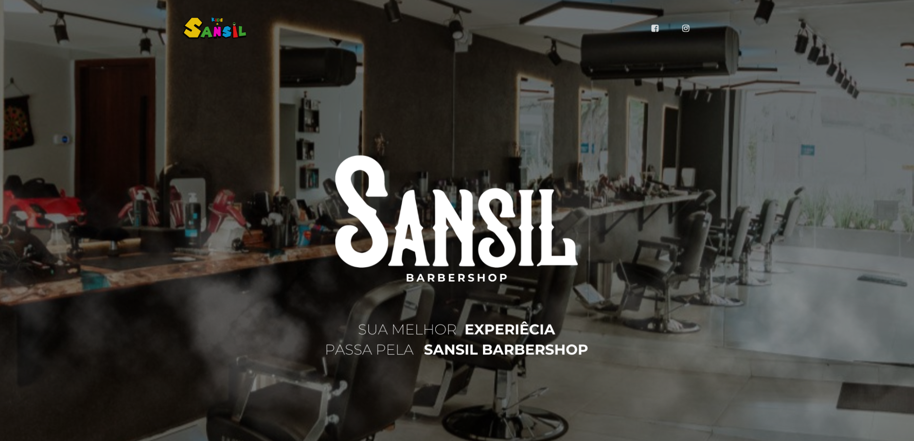

# Sansil.v2



# Home


## Estrutura de arquivo

```
├── CHANGELOG.md
├── LICENSE.md
├── README.md
├── assets
│   ├── css
│   │   ├── bootstrap.min.css
│   │   ├── demo.css
│   │   └── pacote.css
│   ├── img
│   ├── js
│   │   ├── bootstrap-datetimepicker.min.js
│   │   ├── bootstrap-switch.min.js
│   │   ├── bootstrap.min.js
│   │   ├── jquery-3.2.1.js
│   │   ├── jquery-ui-1.12.1.custom.min.js
│   │   ├── moment.min.js
│   │   ├── nouislider.js
│   │   ├── pacote.js
│   │   └── popper.min.js
│   └── sass
├── documentation
│   └── tutorial-components.html
├── examples
│   ├── landing-page.html
│   ├── profile-page.html
│   └── register-page.html
├── index.html
├── nucleo-icons-demo.html
└── template.html

```

## Browser Support

At present, we officially aim to support the last two versions of the following browsers:

    


### Social Media


Facebook: <https://www.facebook.com/thayna.negresco/>


Instagram: <https://www.instagram.com/negrescooficial>
